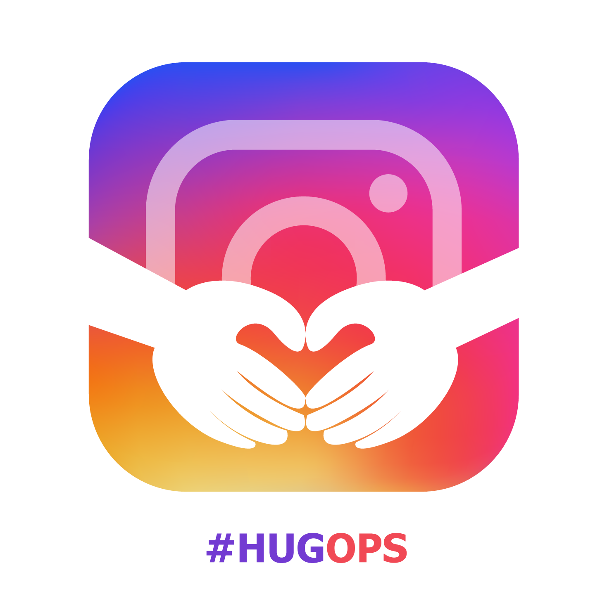
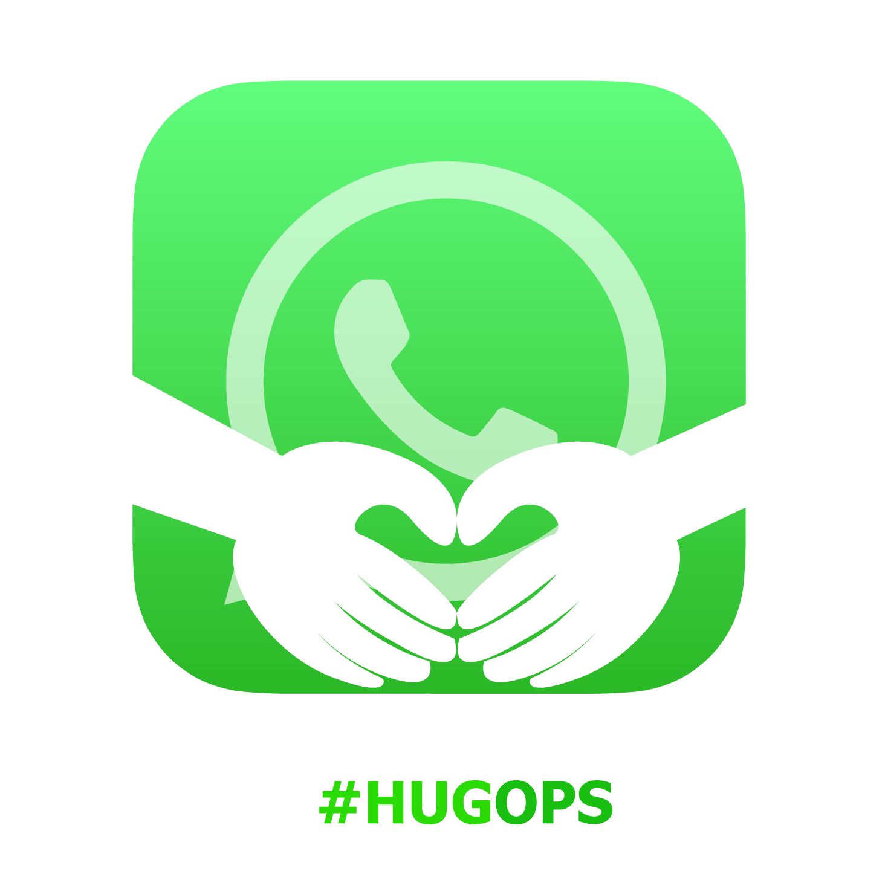
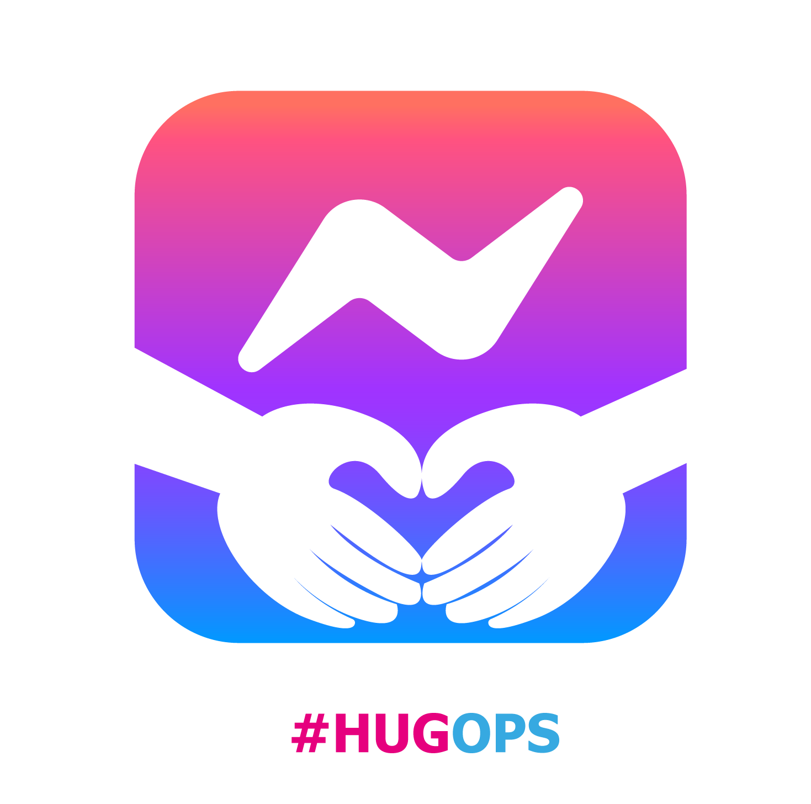
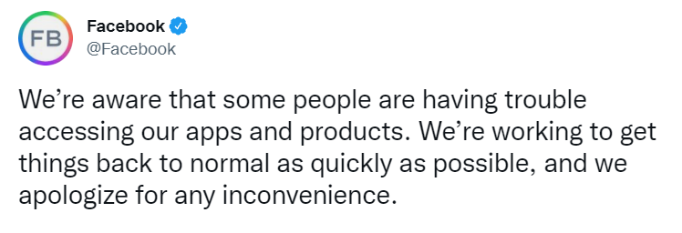
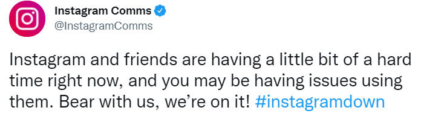
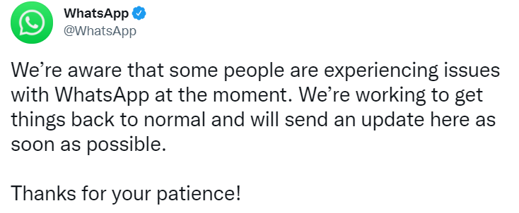
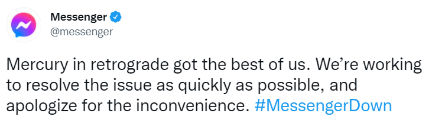
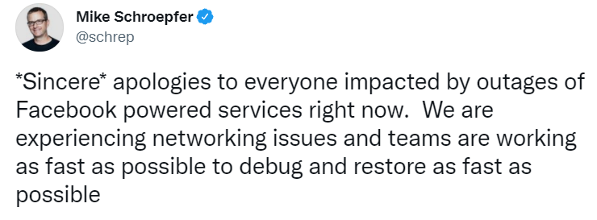

# hugops-facebook
hugops facebook 10-04-2021

 

## What is HugOps?
> Put simply, HugOps is a way to celebrate the human, empathetic side of building, shipping, and running software. It is a take on the word “DevOps” (breaking down silos between Dev and Ops teams through communication, empathy, etc. to ultimately ship faster), but it extends to folks on all different Software, Support, and IT teams. It is a means of acknowledging the real humans working 24/7 to keep the services we rely on running as naturally as water; it exhalts empathy, cross-team collaboration, and trust as the keys to finding problems and shipping solutions faster; and it is a feel good Twitter movement that is much welcomed on a platform that sees its fair share of negativity and trolling. While #HugOps are typically shared during outages, we love the idea of using it when things are going right, too. Like sending flowers or candy or pizza to your friend or partner “just because.”   🔗 [reference](https://www.atlassian.com/blog/statuspage/be-kind-during-downtime-send-hugops-love-today-and-every-day)

 

## HugOps From :
- [Amir Shokri](https://github.com/amirshnll)

## Design From :
-  [Sodeh Mohammadabadi](https://github.com/irSodeh)
 

**Add your name and your github profile**

 

## Share HugOps in social + banner

### Facebook HugOps

### Instagram HugOps

### Whatsapp HugOps

### Messenger HugOps

  
**You can use these banners for support on social networks**

 

## Update + Tweets

